```dot
digraph G {
  rankdir=TB
  fontcolor=white

bbn  -> khc -> kvj [label="AND" fontcolor="white"]
bbn  -> khc -> z15 [label="XOR" fontcolor="white"]
bjh  -> bcf -> tsf [label="OR" fontcolor="white"]
bkg  -> skg -> rvw [label="AND" fontcolor="white"]
bkj  -> fhq -> wjd [label="AND" fontcolor="white"]
bkj  -> fhq -> dtv [label="XOR" fontcolor="white"]
bqr  -> gdf -> npt [label="AND" fontcolor="white"]
bvf  -> mgj -> rsn [label="AND" fontcolor="white"]
cfb  -> rqg -> z08 [label="XOR" fontcolor="white"]
ckj  -> kjg -> khc [label="OR" fontcolor="white"]
cmd  -> jrv -> qbc [label="AND" fontcolor="white"]
dgd  -> fnw -> z17 [label="XOR" fontcolor="white"]
dgr  -> rrd -> vtc [label="AND" fontcolor="white"]
dgr  -> rrd -> z33 [label="XOR" fontcolor="white"]
dmd  -> hgt -> rnc [label="OR" fontcolor="white"]
dnm  -> nvk -> z10 [label="XOR" fontcolor="white"]
dqm  -> dfw -> mmh [label="AND" fontcolor="white"]
dqm  -> dfw -> z39 [label="XOR" fontcolor="white"]
drs  -> cvg -> gwc [label="AND" fontcolor="white"]
drs  -> cvg -> z43 [label="XOR" fontcolor="white"]
dtp  -> hdp -> wng [label="AND" fontcolor="white"]
dtp  -> hdp -> z32 [label="XOR" fontcolor="white"]
dws  -> jkb -> tsk [label="AND" fontcolor="white"]
dws  -> jkb -> z38 [label="XOR" fontcolor="white"]
fcw  -> hrn -> jjw [label="AND" fontcolor="white"]
fcw  -> hrn -> z18 [label="XOR" fontcolor="white"]
fgc  -> whc -> gdr [label="AND" fontcolor="white"]
fgc  -> whc -> z13 [label="XOR" fontcolor="white"]
fnw  -> dgd -> mjj [label="AND" fontcolor="white"]
fsf  -> nqs -> z12 [label="OR" fontcolor="white"]
fvf  -> ncn -> hvq [label="OR" fontcolor="white"]
gdf  -> bqr -> z40 [label="XOR" fontcolor="white"]
gdr  -> wfh -> dtw [label="OR" fontcolor="white"]
gdv  -> hkd -> qkt [label="AND" fontcolor="white"]
ghp  -> tjc -> z06 [label="XOR" fontcolor="white"]
gkc  -> tff -> cfb [label="OR" fontcolor="white"]
gpj  -> njh -> jmr [label="OR" fontcolor="white"]
gsv  -> rvw -> pdf [label="OR" fontcolor="white"]
gwc  -> tdb -> nfm [label="OR" fontcolor="white"]
hbg  -> rwk -> jhc [label="AND" fontcolor="white"]
hbg  -> rwk -> z41 [label="XOR" fontcolor="white"]
hgm  -> gwk -> qjk [label="OR" fontcolor="white"]
hgw  -> kbf -> mjs [label="AND" fontcolor="white"]
hgw  -> kbf -> z27 [label="XOR" fontcolor="white"]
hkd  -> gdv -> z30 [label="XOR" fontcolor="white"]
hrb  -> pfd -> z35 [label="XOR" fontcolor="white"]
jfk  -> vkb -> z29 [label="AND" fontcolor="white"]
jfr  -> qhf -> jrv [label="OR" fontcolor="white"]
jhc  -> vhd -> nmj [label="OR" fontcolor="white"]
jjw  -> jvf -> ntr [label="OR" fontcolor="white"]
jmr  -> qts -> fsf [label="AND" fontcolor="white"]
jmr  -> qts -> fgc [label="XOR" fontcolor="white"]
jrv  -> cmd -> z25 [label="XOR" fontcolor="white"]
jvp  -> rjs -> jfk [label="OR" fontcolor="white"]
jwd  -> fvv -> nbs [label="OR" fontcolor="white"]
kfp  -> hss -> pfd [label="OR" fontcolor="white"]
kgm  -> nkt -> hgw [label="OR" fontcolor="white"]
kjp  -> nmj -> rjd [label="AND" fontcolor="white"]
kjp  -> nmj -> z42 [label="XOR" fontcolor="white"]
knm  -> vvh -> z02 [label="XOR" fontcolor="white"]
kvj  -> knn -> prk [label="OR" fontcolor="white"]
mbg  -> ggm -> skg [label="OR" fontcolor="white"]
mbs  -> kvv -> gvm [label="AND" fontcolor="white"]
mbs  -> kvv -> z36 [label="XOR" fontcolor="white"]
mgf  -> dqq -> bvf [label="OR" fontcolor="white"]
mgj  -> bvf -> z05 [label="XOR" fontcolor="white"]
mjs  -> cwb -> rhr [label="OR" fontcolor="white"]
mmh  -> vhw -> bqr [label="OR" fontcolor="white"]
mvg  -> cgn -> tnj [label="OR" fontcolor="white"]
nbq  -> wpt -> z26 [label="XOR" fontcolor="white"]
nbs  -> wct -> z22 [label="XOR" fontcolor="white"]
nfm  -> nww -> fbj [label="AND" fontcolor="white"]
njb  -> tkb -> z01 [label="XOR" fontcolor="white"]
nkg  -> npt -> rwk [label="OR" fontcolor="white"]
nvk  -> dnm -> cgn [label="AND" fontcolor="white"]
nww  -> nfm -> z44 [label="XOR" fontcolor="white"]
pdf  -> npf -> qhf [label="AND" fontcolor="white"]
pdf  -> npf -> z24 [label="XOR" fontcolor="white"]
pfd  -> hrb -> sts [label="AND" fontcolor="white"]
pjs  -> vmr -> fvv [label="AND" fontcolor="white"]
prk  -> hsj -> trs [label="AND" fontcolor="white"]
prk  -> hsj -> z16 [label="XOR" fontcolor="white"]
qgr  -> ght -> vmr [label="OR" fontcolor="white"]
qhs  -> fwv -> wvr [label="OR" fontcolor="white"]
qjk  -> fck -> dqq [label="AND" fontcolor="white"]
qjk  -> fck -> z04 [label="XOR" fontcolor="white"]
qkt  -> qgt -> sdf [label="OR" fontcolor="white"]
qqn  -> tnj -> njh [label="AND" fontcolor="white"]
rhr  -> gwd -> rjs [label="AND" fontcolor="white"]
rhr  -> gwd -> z28 [label="XOR" fontcolor="white"]
rjd  -> tbv -> cvg [label="OR" fontcolor="white"]
rkd  -> gvm -> fhq [label="OR" fontcolor="white"]
rnc  -> rnf -> z09 [label="XOR" fontcolor="white"]
rnf  -> rnc -> rmd [label="AND" fontcolor="white"]
rqg  -> cfb -> hgt [label="AND" fontcolor="white"]
rsj  -> ntr -> bjh [label="AND" fontcolor="white"]
rsj  -> ntr -> z19 [label="XOR" fontcolor="white"]
rsn  -> rfc -> ghp [label="OR" fontcolor="white"]
sdf  -> snd -> z31 [label="XOR" fontcolor="white"]
sfq  -> wvr -> hgm [label="AND" fontcolor="white"]
skg  -> bkg -> z23 [label="XOR" fontcolor="white"]
snd  -> sdf -> tvn [label="AND" fontcolor="white"]
sts  -> skr -> mbs [label="OR" fontcolor="white"]
tjc  -> ghp -> fvf [label="AND" fontcolor="white"]
tjm  -> rmd -> dnm [label="OR" fontcolor="white"]
tkb  -> njb -> hfp [label="AND" fontcolor="white"]
tnj  -> qqn -> z11 [label="XOR" fontcolor="white"]
tqp  -> mjj -> hrn [label="OR" fontcolor="white"]
trs  -> gfs -> dgd [label="OR" fontcolor="white"]
tsf  -> wpm -> qgr [label="AND" fontcolor="white"]
tsk  -> wms -> dqm [label="OR" fontcolor="white"]
tvn  -> rhk -> dtp [label="OR" fontcolor="white"]
vdj  -> hvq -> gkc [label="AND" fontcolor="white"]
vdj  -> hvq -> z07 [label="XOR" fontcolor="white"]
vjw  -> hfp -> knm [label="OR" fontcolor="white"]
vkb  -> jfk -> mtj [label="XOR" fontcolor="white"]
vmr  -> pjs -> z21 [label="XOR" fontcolor="white"]
vvh  -> knm -> fwv [label="AND" fontcolor="white"]
vvm  -> vtc -> wrd [label="OR" fontcolor="white"]
vwd  -> qbc -> wpt [label="OR" fontcolor="white"]
wbg  -> mtj -> gdv [label="OR" fontcolor="white"]
wct  -> nbs -> mbg [label="AND" fontcolor="white"]
wjd  -> dtv -> jkb [label="OR" fontcolor="white"]
wng  -> gtw -> rrd [label="OR" fontcolor="white"]
wpb  -> fbj -> z45 [label="OR" fontcolor="white"]
wpm  -> tsf -> z20 [label="XOR" fontcolor="white"]
wpt  -> nbq -> kgm [label="AND" fontcolor="white"]
wrb  -> dtw -> kjg [label="AND" fontcolor="white"]
wrb  -> dtw -> z14 [label="XOR" fontcolor="white"]
wrd  -> djc -> kfp [label="AND" fontcolor="white"]
wrd  -> djc -> z34 [label="XOR" fontcolor="white"]
wvr  -> sfq -> z03 [label="XOR" fontcolor="white"]
x00  -> y00 -> njb [label="AND" fontcolor="white"]
x00  -> y00 -> z00 [label="XOR" fontcolor="white"]
x01  -> y01 -> tkb [label="XOR" fontcolor="white"]
x02  -> y02 -> qhs [label="AND" fontcolor="white"]
x04  -> y04 -> mgf [label="AND" fontcolor="white"]
x04  -> y04 -> fck [label="XOR" fontcolor="white"]
x05  -> y05 -> mgj [label="XOR" fontcolor="white"]
x08  -> y08 -> dmd [label="AND" fontcolor="white"]
x09  -> y09 -> tjm [label="AND" fontcolor="white"]
x09  -> y09 -> rnf [label="XOR" fontcolor="white"]
x10  -> y10 -> nvk [label="XOR" fontcolor="white"]
x11  -> y11 -> gpj [label="AND" fontcolor="white"]
x11  -> y11 -> qqn [label="XOR" fontcolor="white"]
x13  -> y13 -> whc [label="XOR" fontcolor="white"]
x14  -> y14 -> ckj [label="AND" fontcolor="white"]
x16  -> y16 -> gfs [label="AND" fontcolor="white"]
x17  -> y17 -> fnw [label="XOR" fontcolor="white"]
x19  -> y19 -> rsj [label="XOR" fontcolor="white"]
x20  -> y20 -> ght [label="AND" fontcolor="white"]
x24  -> y24 -> jfr [label="AND" fontcolor="white"]
x25  -> y25 -> vwd [label="AND" fontcolor="white"]
x25  -> y25 -> cmd [label="XOR" fontcolor="white"]
x27  -> y27 -> cwb [label="AND" fontcolor="white"]
x27  -> y27 -> kbf [label="XOR" fontcolor="white"]
x28  -> y28 -> jvp [label="AND" fontcolor="white"]
x28  -> y28 -> gwd [label="XOR" fontcolor="white"]
x30  -> y30 -> qgt [label="AND" fontcolor="white"]
x30  -> y30 -> hkd [label="XOR" fontcolor="white"]
x31  -> y31 -> rhk [label="AND" fontcolor="white"]
x32  -> y32 -> gtw [label="AND" fontcolor="white"]
x34  -> y34 -> hss [label="AND" fontcolor="white"]
x36  -> y36 -> kvv [label="XOR" fontcolor="white"]
x37  -> y37 -> z37 [label="AND" fontcolor="white"]
x38  -> y38 -> dws [label="XOR" fontcolor="white"]
x39  -> y39 -> dfw [label="XOR" fontcolor="white"]
x40  -> y40 -> nkg [label="AND" fontcolor="white"]
x40  -> y40 -> gdf [label="XOR" fontcolor="white"]
x41  -> y41 -> vhd [label="AND" fontcolor="white"]
x41  -> y41 -> hbg [label="XOR" fontcolor="white"]
x43  -> y43 -> drs [label="XOR" fontcolor="white"]
y01  -> x01 -> vjw [label="AND" fontcolor="white"]
y02  -> x02 -> vvh [label="XOR" fontcolor="white"]
y03  -> x03 -> gwk [label="AND" fontcolor="white"]
y03  -> x03 -> sfq [label="XOR" fontcolor="white"]
y05  -> x05 -> rfc [label="AND" fontcolor="white"]
y06  -> x06 -> ncn [label="AND" fontcolor="white"]
y06  -> x06 -> tjc [label="XOR" fontcolor="white"]
y07  -> x07 -> tff [label="AND" fontcolor="white"]
y07  -> x07 -> vdj [label="XOR" fontcolor="white"]
y08  -> x08 -> rqg [label="XOR" fontcolor="white"]
y10  -> x10 -> mvg [label="AND" fontcolor="white"]
y12  -> x12 -> nqs [label="AND" fontcolor="white"]
y12  -> x12 -> qts [label="XOR" fontcolor="white"]
y13  -> x13 -> wfh [label="AND" fontcolor="white"]
y14  -> x14 -> wrb [label="XOR" fontcolor="white"]
y15  -> x15 -> knn [label="AND" fontcolor="white"]
y15  -> x15 -> bbn [label="XOR" fontcolor="white"]
y16  -> x16 -> hsj [label="XOR" fontcolor="white"]
y17  -> x17 -> tqp [label="AND" fontcolor="white"]
y18  -> x18 -> jvf [label="AND" fontcolor="white"]
y18  -> x18 -> fcw [label="XOR" fontcolor="white"]
y19  -> x19 -> bcf [label="AND" fontcolor="white"]
y20  -> x20 -> wpm [label="XOR" fontcolor="white"]
y21  -> x21 -> jwd [label="AND" fontcolor="white"]
y21  -> x21 -> pjs [label="XOR" fontcolor="white"]
y22  -> x22 -> ggm [label="AND" fontcolor="white"]
y22  -> x22 -> wct [label="XOR" fontcolor="white"]
y23  -> x23 -> gsv [label="AND" fontcolor="white"]
y23  -> x23 -> bkg [label="XOR" fontcolor="white"]
y24  -> x24 -> npf [label="XOR" fontcolor="white"]
y26  -> x26 -> nkt [label="AND" fontcolor="white"]
y26  -> x26 -> nbq [label="XOR" fontcolor="white"]
y29  -> x29 -> wbg [label="AND" fontcolor="white"]
y29  -> x29 -> vkb [label="XOR" fontcolor="white"]
y31  -> x31 -> snd [label="XOR" fontcolor="white"]
y32  -> x32 -> hdp [label="XOR" fontcolor="white"]
y33  -> x33 -> dgr [label="AND" fontcolor="white"]
y33  -> x33 -> vvm [label="XOR" fontcolor="white"]
y34  -> x34 -> djc [label="XOR" fontcolor="white"]
y35  -> x35 -> skr [label="AND" fontcolor="white"]
y35  -> x35 -> hrb [label="XOR" fontcolor="white"]
y36  -> x36 -> rkd [label="AND" fontcolor="white"]
y37  -> x37 -> bkj [label="XOR" fontcolor="white"]
y38  -> x38 -> wms [label="AND" fontcolor="white"]
y39  -> x39 -> vhw [label="AND" fontcolor="white"]
y42  -> x42 -> tbv [label="AND" fontcolor="white"]
y42  -> x42 -> kjp [label="XOR" fontcolor="white"]
y43  -> x43 -> tdb [label="AND" fontcolor="white"]
y44  -> x44 -> wpb [label="AND" fontcolor="white"]
y44  -> x44 -> nww [label="XOR" fontcolor="white"]
}
```

# Day 24

## prelude

https://adventofcode.com/2024/day/24

```js echo
import { inputDay, munge } from "./lib/utilities.js"
```

```js echo
const parser = inp => {
  let [gates, operations] = inp.trim().split("\n\n").map(munge)
  return [new Map(gates), operations]
}

const test = parser(
  "x00: 1\nx01: 1\nx02: 1\ny00: 0\ny01: 1\ny02: 0\n\nx00 AND y00 -> z00\nx01 XOR y01 -> z01\nx02 OR y02 -> z02",
)
display(test)

const input = await inputDay(24, { parser })
display(input)
```

## part 1

```js echo
function run(gates, operations) {
  const zs = operations
    .filter(([, , , , out]) => out.startsWith("z"))
    .map(([, , , , out]) => out)
    .sort((a, b) => a < b)
  while (!zs.every(z => gates.has(z))) {
    for (const [a, op, b, , out] of operations) {
      if (!gates.has(a) || !gates.has(b)) continue
      switch (op) {
        case "AND":
          gates.set(out, gates.get(a) & gates.get(b))
          break
        case "OR":
          gates.set(out, gates.get(a) | gates.get(b))
          break
        case "XOR":
          gates.set(out, gates.get(a) ^ gates.get(b))
          break
      }
    }
  }
  return parseInt(zs.map(z => gates.get(z)).join(""), 2)
}

display(run(...test))
display(run(...input))
```

## part 2

To solve part 2, I figured out the structure of the 44-bit adder, took notes on what each bit was supposed to look like, then wrote this program to find four spots where the adder was wrong; then I manually verified them and found what they should have been swapped with.

[This page helped me](https://www.iitg.ac.in/cseweb/vlab/Digital-System-Lab/fa_lg.php?id=9) figure out what the structure of the adder was.

To add bits a and b, with an output bit and a carry bit, we have (where ${tex`\oplus`} is xor):

```tex
a \oplus b \oplus carry \rarr out \\
a \oplus b \thickspace \& \thickspace carry \thickspace | \thickspace (a \thickspace \& \thickspace b) \rarr carry
```

By looking at the given operations, I saw that the adder is implemented on bit 1 with carry bit `c01` as:

```
x01 ^ y01 -> temp1
temp1 ^ c01 -> z01
x01 & y01 -> temp2
temp1 & carry -> temp3
temp2 | temp3 -> c02
```

So I wrote this program to find the instructions that weren't structured as expected

```js echo
function findswaps(operations) {
  for (let i = 1; i < 45; i++) {
    let x = `x${String(i).padStart(2, "0")}`
    let y = `y${String(i).padStart(2, "0")}`
    let z = `z${String(i).padStart(2, "0")}`

    // find yN ^ xN -> temp1 or xN ^ yN -> temp1
    const temp1 = operations.find(
      ([a, op, b, , out]) =>
        op == "XOR" && ((a == x && b == y) || (a == y && b == x)),
    )[4]
    if (!temp1) {
      display(`failed to find: ${x} ^ ${y} = _`)
      continue
    }

    // find temp1 ^ carry = zN
    const res = operations.find(([a, op, b, , out]) => op == "XOR" && out == z)
    if (!res) {
      display(`failed to find: _ ^ _ = ${z}`)
      continue
    }
    const carry = res[0] == temp1 ? res[2] : res[0]

    // find yN & xN -> temp2
    const temp2 = operations.find(
      ([a, op, b, , out]) =>
        op == "AND" && ((a == x && b == y) || (a == y && b == x)),
    )[4]
    if (!temp2) {
      display(`failed to find: ${x} & ${y} = _`)
      continue
    }

    // find temp1 ^ carry -> temp3
    const res2 = operations.find(
      ([a, op, b, , out]) =>
        op == "XOR" &&
        ((a == temp1 && b == carry) || (a == carry && b == temp1)),
    )
    if (!res2) {
      display(`failed to find: ${temp1} ^ ${carry} = _`)
      continue
    }
    const temp3 = res2[4]
  }
}
findswaps(input[1])
```


